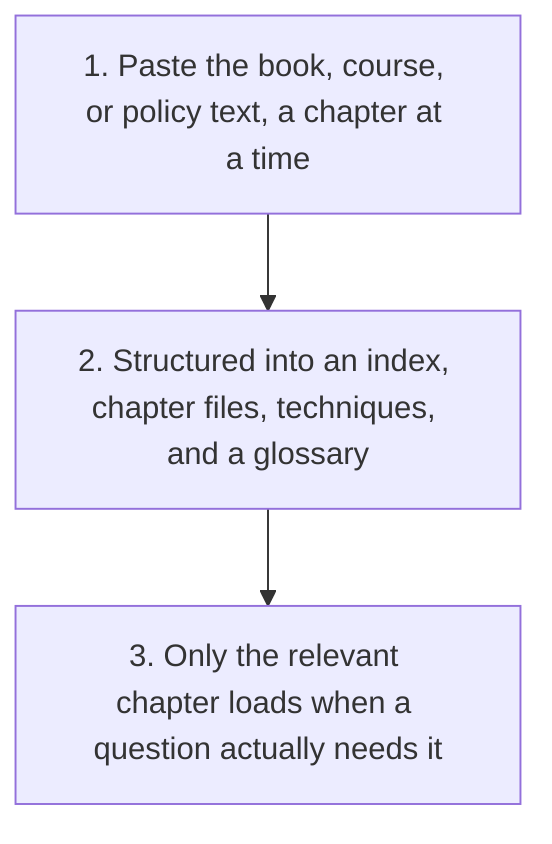

# Book to Skill

  
  

Turn a book you already own into a Claude skill: a short index plus one file per chapter, so an AI assistant can consult it chapter by chapter instead of holding the whole thing in context every time. Also works for a training course or an internal policy document, not just a book.

## Why

Loading a 400-page book fully can cost hundreds of thousands of tokens before you have asked a single question, and most of those tokens go unused on any given answer, since only a chapter or two is usually relevant. This restructures a book the same way any other AI skill is structured: a short file that is always loaded, and deeper material that only opens when a specific step actually needs it.

## Use It

Copy [SKILL.md](SKILL.md) and paste it into your AI tool (ChatGPT, Claude, Gemini, or similar), then paste in the book's text, a chapter at a time for a long book. It builds:

- **An index file**: the book's argument in one paragraph, a chapter list, and where the glossary and techniques document live, kept short enough to load every time
- **One file per chapter**: structured concepts and techniques, not a copy of the original prose
- **A techniques and patterns document**: every named method in the book, with the chapter it came from
- **A glossary**: definitions for terms the book uses in a specific way

<strong>See exactly what it produces</strong>

1. A short index file, the book's argument in one paragraph, a chapter list, and pointers to the glossary and techniques document
2. One structured file per chapter, concepts and techniques rather than a copy of the prose
3. A techniques and patterns document, and a glossary, each built once and reused across chapters
4. For a policy or course, any contradiction between sections flagged in the index, not silently resolved

No installation, project, or coding required to try it once. Doing this regularly for the same book is easiest inside a Claude Project, a Custom GPT, or a Gemini Gem, where the generated files can be attached as knowledge once and reused.

See [the worked example](example/) for what this actually produces, three chapters of *The Art of War* structured this way, chosen because it is old enough to be public domain everywhere.

See [the second worked example](example-two/) for the one genuine difference when the source is a policy rather than a book: a policy can contradict itself between sections in a way a book rarely does, and the index needs to flag that rather than silently pick a side.

Use [the review checklist](checks/checklist.md) before relying on the generated files.

## Before You Use It

Only use a book you have the legal right to read: one you bought, borrowed properly, or that is in the public domain. The output is for your own private use. Do not publish, resell, or redistribute the chapter files, the techniques document, or the glossary.

The tool itself, [SKILL.md](SKILL.md), never contains, ships, or requires any actual book content; you provide that yourself, from a copy you already have the right to read, and the output stays with you. The one exception is the worked example folder, which deliberately uses a public-domain text so the demonstration itself carries no copyright risk.

## Licence

MIT. Use, adapt, or share the tool itself freely. It never contains anyone's copyrighted book content, only the method for structuring your own.

## Feedback

Tried it on a real book? [Start a discussion](https://github.com/shaunmarsden/book-to-skill/discussions) if something did not work the way you expected, or if the output format could be better.

## Part of a Family

This was the first of a growing family of free tools; the rest generalise [practical-ai-sales-workflows](https://github.com/shaunmarsden/practical-ai-sales-workflows) patterns beyond sales. See [sibling-projects](https://github.com/shaunmarsden/sibling-projects) for the rest, or use [the router](https://github.com/shaunmarsden/sibling-projects/blob/main/ROUTER.md) if you are not sure which one actually fits.
